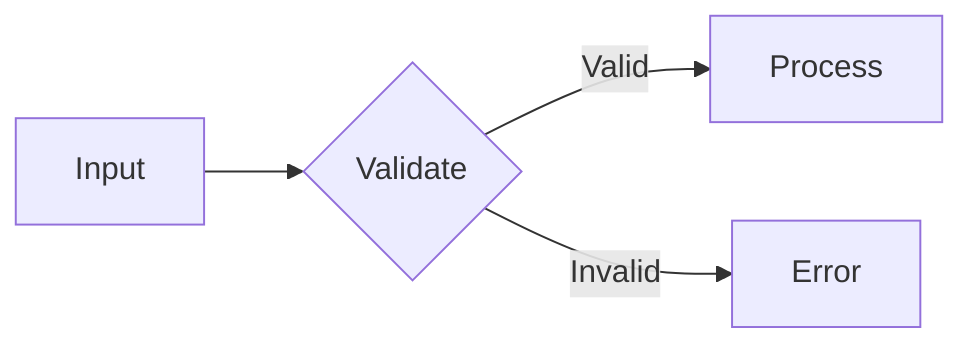

# GitHub Flavored Markdown

Conventions for writing Markdown that renders correctly on GitHub. Standard Markdown rules apply — this covers GitHub-specific extensions and common pitfalls.

## Task Lists

```markdown
- [ ] Unchecked item
- [x] Checked item
  - [ ] Nested task
```

- Work in issues, PRs, and comments — GitHub tracks completion percentage
- Nest with indentation (2 spaces)
- Users can toggle checkboxes directly in the GitHub UI

## Alert Callouts

```markdown
> [!NOTE]
> Useful background information.

> [!TIP]
> Helpful advice for better results.

> [!IMPORTANT]
> Key information users need to know.

> [!WARNING]
> Potential issues that need attention.

> [!CAUTION]
> Serious risks or dangerous actions.
```

- Use `NOTE` for neutral context, `TIP` for suggestions, `WARNING` for gotchas
- `CAUTION` renders in red — reserve for destructive actions or data loss risks
- Content must be inside the blockquote (prefix every line with `> `)

## Collapsible Sections

```markdown
<details>
<summary>Click to expand</summary>

Content goes here. **Markdown works inside.**

- Lists work
- Code blocks work

</details>
```

- Use for long logs, stack traces, verbose output, or optional detail
- **Blank line required** between `<summary>` and content for Markdown to render
- Nest collapsibles for multi-level detail (but don't go deeper than 2 levels)

## Mermaid Diagrams

````markdown

````

Common diagram types:
- `flowchart LR` / `flowchart TD` — flow diagrams (left-right or top-down)
- `sequenceDiagram` — interaction between components
- `stateDiagram-v2` — state machines
- `classDiagram` — class relationships

Keep mermaid diagrams simple — complex ones break or render poorly on GitHub. For anything with more than ~15 nodes, use an image instead.

## Tables

```markdown
| Left | Center | Right |
|:-----|:------:|------:|
| text | text   | text  |
```

- `:---` left-align, `:---:` center, `---:` right-align
- Escape pipes in content with `\|`
- Keep tables under ~80 chars wide — wide tables scroll awkwardly on mobile
- For complex data, prefer lists or collapsible sections over massive tables

## Code Blocks

````markdown
```typescript
const x: number = 42;
```

```diff
- const old = "before";
+ const new = "after";
```

```bash
echo "executable command"
```
````

- Always specify the language tag for syntax highlighting
- Use `diff` with `+`/`-` prefixes to show changes in context
- Use `bash` for shell commands, `console` for command + output
- Inline code: `` `backticks` `` for short references

## Cross-References

| Syntax | Links To |
|--------|----------|
| `#123` | Issue or PR in same repo |
| `org/repo#123` | Issue or PR in another repo |
| `@username` | User mention (notifies them) |
| `@org/team` | Team mention (notifies team) |
| `SHA` (7+ chars) | Commit reference |
| `org/repo@SHA` | Commit in another repo |

**Auto-close keywords** in PR descriptions (only when merged to default branch):
- `Fixes #123`, `Closes #123`, `Resolves #123`
- Multiple: `Fixes #123, Closes #456`

## Images & Media

```markdown

```

- Always include alt text — accessibility matters and it shows when images fail to load
- For sizing, use HTML: ``
- Drag-and-drop in GitHub's web editor auto-uploads to `user-images.githubusercontent.com`
- Use `<video>` tags for screen recordings (GitHub supports mp4 embeds in comments)

## Footnotes

```markdown
This claim needs a source[^1].

[^1]: Source: https://example.com/evidence
```

- Footnotes render at the bottom of the document
- Useful for citations in longer documents, READMEs, or RFCs
- Numbered automatically regardless of label order

## Relative Links

```markdown
See [the guide](./docs/guide.md)
[Source code](src/main.ts)
```

- Paths resolve from the file's location in the repo
- Work in READMEs, wikis, and rendered Markdown files
- Use `./` prefix for clarity
- Link to specific lines: `[code](src/main.ts#L42)` or ranges: `#L10-L20`

## HTML in Markdown

GitHub sanitizes HTML — only a safe subset renders:

```markdown
<kbd>Ctrl</kbd> + <kbd>C</kbd>          <!-- Keyboard shortcuts -->
<sup>superscript</sup>                   <!-- Footnote-style markers -->
<sub>subscript</sub>                     <!-- Chemical formulas -->
<br>                                     <!-- Line break in tables -->
<ins>inserted text</ins>                 <!-- Underline / highlight additions -->
<del>deleted text</del>                  <!-- Strikethrough alternative -->
```

- `<kbd>` is great for documenting keyboard shortcuts
- `<br>` is the only way to force line breaks inside table cells
- `<div align="center">` works for centering in READMEs
- Most other HTML tags are stripped — don't rely on `<style>`, `<script>`, or complex layouts

## Emoji

```markdown
:bug: :sparkles: :memo: :rocket: :warning: :white_check_mark:
```

- Use sparingly in headings or callouts — too many emoji reduce readability
- Common in PR titles: `:sparkles: feat:`, `:bug: fix:`, `:memo: docs:`
- GitHub renders the full [emoji shortcode list](https://github.com/ikatyang/emoji-cheat-sheet)

## Anti-Patterns

- **Deeply nested headers** (H4+) — flatten to H2/H3 for scannability
- **Enormous tables** — use collapsible sections or lists instead
- **Untagged code blocks** — always add a language tag for highlighting
- **Broken relative links** — test by clicking them in the rendered preview
- **Images without alt text** — inaccessible and shows nothing on failure
- **Raw URLs** instead of `[descriptive text](url)` — unreadable in source view
- **Trailing whitespace in tables** — causes rendering inconsistencies
